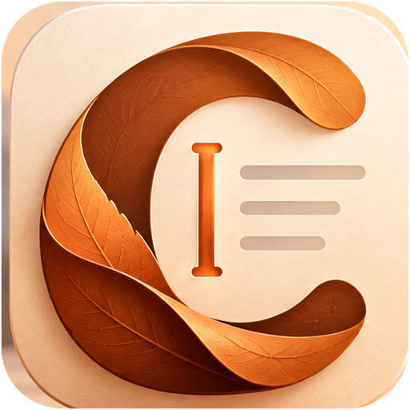

<p align="center">
  
</p>

<h1 align="center">Caret Portable</h1>

<p align="center">
  <strong>Convert Office documents to Markdown with Microsoft MarkItDown, on locked-down Windows PCs, with nothing to install.</strong>
</p>

---

Caret Portable is a run-from-a-folder build of [Caret](https://github.com/fegyenc/Caret), made for corporate PCs where people can install Python and pip packages for their own account but **can't install applications, change PATH or trust certificates**.

- **No installer, no MSIX, no admin rights.** Unzip and double-click `Caret.exe`. The .NET runtime and the Windows App SDK are inside the folder.
- **Every conversion runs through [Microsoft MarkItDown](https://github.com/microsoft/markitdown)** in the Python the user already has. Caret finds that Python without PATH (the py launcher, `%LOCALAPPDATA%\Programs\Python`, Program Files, Anaconda, Store Python, or a `python` folder next to the app), or the user points it at a `python.exe`.
- **Outlook emails too.** `.msg` and `.eml` become one clean Markdown thread (oldest first, without repeated quotes, signatures and disclaimers), with names, addresses and phone numbers masked by default. This is Caret's own MarkItDown email plugin, shipped inside the folder.
- **One file, many files, or a whole folder with its subfolders.** Output goes next to the originals or into a chosen folder (keeping the subfolder layout), and existing files are never overwritten.
- **Can install MarkItDown for you** with `pip install --user` into that Python. No PATH or registry changes, and an organization can turn this off with a policy.
- **Everything stays in the folder.** Settings, recent files and the editor cache live in `Data\` next to `Caret.exe`.

The user guide that ships inside the zip is **[docs/user-guide.md](docs/user-guide.md)**. What changed in each version is in **[CHANGELOG.md](CHANGELOG.md)**.

## Get it

Download `Caret-Portable-<version>-x64.zip` (or `-ARM64`) from the latest **Portable build** run under [Actions](../../actions/workflows/portable.yml), or from [Releases](../../releases) for tagged versions. Then unzip it and run `Caret.exe`.

Requirements:

- Windows 10 1809 or later, or Windows 11
- the WebView2 Runtime (already on Windows 11 and on most managed Windows 10 PCs)
- Python 3.10 or later with `markitdown[docx,pptx,xlsx,xls,pdf,outlook]`

## How it differs from Caret

| | Caret | Caret Portable |
| --- | --- | --- |
| Install | MSIX (Store, or sideload with a certificate) | Unzip a folder |
| Converting | Built-in .NET converters, no Python | Microsoft MarkItDown in the user's Python |
| Emails | Built-in C# port of the email plugin | Caret's email plugin, loaded into MarkItDown |
| Formats | Word, Excel, PowerPoint, PDF, CSV, Outlook emails | Those, plus .xls, HTML, EPUB, .ipynb, JSON, XML, RSS, TXT, ZIP |
| Settings | Package data folder | `Data\` next to `Caret.exe` |
| Updates | Store, or a daily GitHub check | Replace the folder |

## The editor

The folder also contains Caret's full Markdown editor, for reading and tidying what was converted:

### Writing
- **View, Code or Split**: formatted editing, plain Markdown, or both side by side with a live preview
- **Formatting toolbar** and the Paragraph and Format menus, with familiar shortcuts
- **Tables, math, footnotes and diagrams**: Mermaid, flowcharts, sequence diagrams, PlantUML, Vega-Lite
- **Paste images and screenshots** straight into a note
- **Find & Replace**, undo and redo, spellcheck, and a live word count

### Organizing
- **Tabs**: several documents in one window, each with its own undo history and unsaved changes. A dot marks unsaved work, `Ctrl+Tab` switches, and `Ctrl+W` closes the document while the window stays open on a start page. Your saved documents reopen the next time Caret starts. Both can be turned off in Settings.
- **Folder workspace** with a live file tree, **Go to File** (`Ctrl+K`), **Favorites**, **Recent** files, **Templates** and **Trash**
- **Multi-window**

### Peace of mind
- **Auto save** that never replaces a saved file with an accidentally empty editor
- **Crash recovery** for unsaved work, even untitled notes
- **Safe links**: web links open in your browser; local links open documents and media only, never scripts

### At home on Windows
- **English, French and Spanish**, following your Windows language or chosen in Settings
- **Five colour schemes** (Copper, Paper, Sage, Harbor, Graphite) in light and dark, all checked for WCAG 2.2 AA contrast, an optional Windows accent, and colours for each area of the window and each tab
- **Three layouts**: Classic, Streamlined, and Distraction-free (`F11`); the sidebar on either side, or narrow
- **Settings is a page** in the window, with search (`Ctrl+,`)
- Export to HTML, PDF or plain text

## Keyboard shortcuts

| Action | Shortcut | | Action | Shortcut |
| --- | --- | --- | --- | --- |
| New note (new tab) | `Ctrl+N` or `Ctrl+T` | | Bold | `Ctrl+B` |
| New window | `Ctrl+Shift+N` | | Italic | `Ctrl+I` |
| Open | `Ctrl+O` | | Underline | `Ctrl+U` |
| Go to file | `Ctrl+K` | | Heading 1–6 | `Ctrl+1` … `Ctrl+6` |
| Save | `Ctrl+S` | | Paragraph | `Ctrl+0` |
| Save as | `Ctrl+Shift+S` | | Task list | `Ctrl+Shift+X` |
| Find & Replace | `Ctrl+F` | | Quote | `Ctrl+Shift+Q` |
| Print | `Ctrl+P` | | Code block | `Ctrl+Shift+K` |
| Next / previous tab | `Ctrl+Tab` / `Ctrl+Shift+Tab` | | Table | `Ctrl+Shift+T` |
| Close document | `Ctrl+W` | | | |
| Close window | `Ctrl+Shift+W` | | | |
| Settings | `Ctrl+,` | | | |
| View / Code / Split | `Ctrl+/` | | | |
| Move between areas of the window | `F6` / `Shift+F6` | | | |
| Distraction-free, full screen | `F11` | | | |

Undo, redo, cut, copy, paste and select all use the standard Windows shortcuts.

## Organization policy

Values under `HKLM\SOFTWARE\Policies\Caret` (or HKCU), set by Group Policy or Intune. The defaults are starting points, not locks: a user who picks something else in Settings keeps it.

| Value | Type | Effect |
| --- | --- | --- |
| `DisableMarkItDownInstall` = `1` | DWORD | Caret never runs pip. It shows the install command for IT or the user to run instead. |
| `DefaultLayout` = `classic` or `streamlined` | String | The window layout people start with |
| `DefaultColorScheme` = `copper`, `paper`, `sage`, `harbour` or `graphite` | String | The colour scheme people start with |
| `DefaultAccentColor` = `scheme` or `windows` | String | Accent from the scheme or from Windows |
| `DefaultTheme` = `system`, `light` or `dark` | String | Light or dark to start with |

## Building from source

Prerequisites:

- Visual Studio 2022 with the **.NET desktop development** workload (.NET 8 SDK) and the **Windows App SDK C# Templates** component
- Node.js LTS with Yarn

```ps
cd src\Caret.Editor
yarn install
yarn build          # editor bundle -> src\Caret.App\Resources\Statics
cd ..\..
./build/package.ps1 -Platform x64   # finds MSBuild itself (vswhere)
```

`out\Caret-Portable` is the portable folder: the `Caret.exe` launcher, `README.md` and `app\` (the self-contained app, trimmed to the English, French and Spanish Windows App SDK resources). For everyday development, open `Caret.sln` and run `Debug_Local` (x64).

The [Portable build](.github/workflows/portable.yml) workflow does the same on `windows-latest` for x64 and ARM64. It also starts the x64 build through the launcher from a fresh folder to check that the editor loads and that `Data\` lands next to the launcher, then uploads the zips. To publish a release, open the workflow under **Actions → Portable build → Run workflow** and enter the version (it must match `<Version>` in `src/Caret.App/Caret.App.csproj` and have a section in `CHANGELOG.md`). That creates the `v<version>` tag and a release with both zips. Pushing a `v*` tag does the same.

## Repository layout

```
Caret.sln                    Visual Studio solution (the app and the launcher)
src/
  Caret.App/                 the app: WinUI 3 + WebView2 on .NET 8
    Services/MarkItDown/     finding Python, the MarkItDown worker (with the email plugin), formats and encodings
    MainWindow.Convert.cs    the Convert to Markdown page
    MainWindow.MarkItDown.cs the Converter panel and File → Import
    Strings/                 English, French and Spanish
  Caret.Editor/              the Markdown editor (React + TypeScript, Muya, CodeMirror)
  Caret.Launcher/            the small Caret.exe at the top of the portable folder
plugins/markitdown-email/    Caret's MarkItDown email plugin (shared with Caret), copied into app\markitdown-plugins
build/package.ps1            builds the portable folder
docs/
  user-guide.md              ships in the zip as README.md
  localization.md            how translations work
  history.md                 the detailed history from Typedown to Caret to Caret Portable
.github/workflows/           Windows build, smoke test and release
```

The C# namespace is still `Typedown.WinUI`, from the project Caret was forked from. It isn't visible to users.

## Credits

Caret Portable is built from [Caret](https://github.com/fegyenc/Caret), which is a fork of **[Typedown](https://github.com/byxiaozhi/Typedown)** by [ZZF](https://github.com/byxiaozhi). Document conversion is done by [Microsoft MarkItDown](https://github.com/microsoft/markitdown). The editor uses [Muya](https://github.com/marktext/muya) and [CodeMirror](https://codemirror.net/). Licences are listed in [THIRD-PARTY-NOTICES.md](THIRD-PARTY-NOTICES.md).

## License

[MIT](LICENSE). The original Typedown copyright notice is kept, as the license requires.
